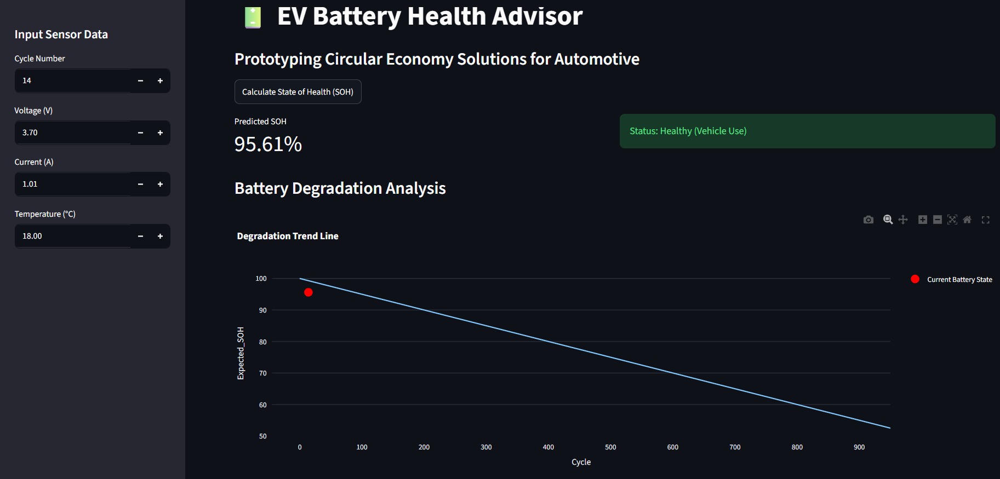
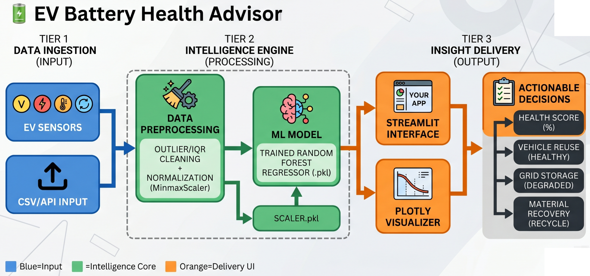

# 🔋 EV Battery Health Advisor




A rapid, AI-driven assessment tool for EV battery state-of-health (SoH) diagnostics, designed to enable circular economy initiatives by automating battery "second-life" grading.

## 🚀 Overview
The EV industry faces a massive bottleneck: the manual, time-consuming diagnostic process required to determine the health of retired vehicle batteries. This project leverages Machine Learning to predict battery SoH from limited sensor telemetry, enabling immediate decision-making—whether a battery should be reused for stationary storage, recycled, or returned to service.

## 🏗️ Architecture
The system uses a modular pipeline to ensure scalability and reliability:



* **Data Ingestion:** Sensors capture real-time Voltage, Current, Temperature, and Cycle data.
* **Preprocessing:** Robust handling of sensor noise using IQR-based outlier removal and `StandardScaler` for feature normalization.
* **Intelligence Engine:** A trained `Random Forest Regressor` provides instant SoH inference.
* **Output:** Interactive dashboard delivering health status and "Second-Life" repurposing recommendations.

## 🛠️ Tech Stack
* **Language:** Python 3.11+
* **Framework:** Streamlit (Frontend/Dashboard)
* **ML Core:** Scikit-learn (Random Forest, StandardScaler)
* **Visualization:** Plotly (Interactive degradation curves)
* **Deployment:** Streamlit Community Cloud

## 📈 Key Performance Metrics

| Metric | Value | Purpose |
| :--- | :--- | :--- |
| **Model Accuracy ($R^2$)** | 0.9964 | Measures the variance explained by features |
| **MAE** | 0.88% | Mean Absolute Error (within ~1% of actual SoH) |
| **Inference Latency** | 18.66 ms | Real-time performance for industrial use |

## 🚀 Getting Started

### Prerequisites
Ensure you have Python 3.11 or higher installed.

### Installation
1. Clone the repository:
   ```bash
   git clone https://github.com/ashwini-sawardekar/EV-Battery-Health-Advisor
   cd ev-battery-health-advisor
   ```

2. Create and activate a virtual environment:
  ```bash
   # Windows:
    python -m venv venv
    venv\Scripts\activate

    # macOS/Linux:
    python -m venv venv
    source venv/bin/activate
  ```

3. Install dependencies:
  ```bash
  pip install -r requirements.txt
  ```

4. Running the App
  ```bash
   streamlit run app.py
  ```

This will launch the dashboard locally at http://localhost:8501.

## 📂 Project Structure

app.py: The main Streamlit dashboard application.

Models/: Contains battery_soh_model.pkl and scaler.pkl.

requirements.txt: Project dependencies.

README.md: Project documentation.

## 📝 License

This project is open-source and available under the MIT License.

## 👨‍💻 Team

Ashwini Sawardekar - Senior Data Engineer / AI Specialist

